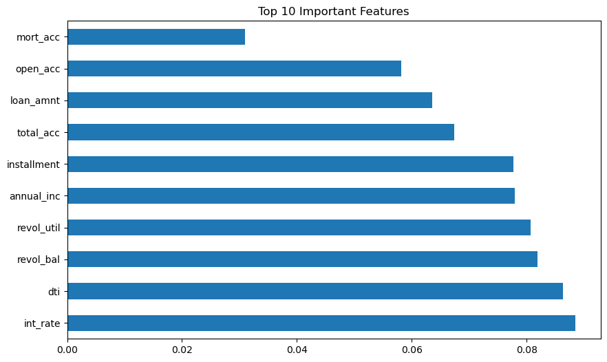

# 🏦 Credit Risk Analysis & Default Prediction


## Executive Summary
This project builds a machine learning classifier to predict loan defaults (**Charge Offs**) for a fintech lending platform. 

The primary challenge was a severe **Class Imbalance** (only ~14% of loans were defaults). While a baseline model achieved **86% accuracy**, it failed to detect a single defaulter (Recall = 0.0). By re-engineering the model to prioritize **Recall** over Accuracy and optimizing decision thresholds, I successfully identified **41% of high-risk borrowers** who would have otherwise been missed.

## The Business Challenge
Lending institutions lose millions when borrowers default. The goal of this model is to:
1.  **Predict Default Probability** at the moment of application.
2.  **Avoid Data Leakage**: rigorously excluding post-origination variables (like `recoveries` or `total_pymnt`) that are unavailable at decision time.
3.  **Minimize Financial Risk**: Prioritizing the detection of "Bad Loans" (False Negatives are more costly than False Positives).

##  Methodology & Tech Stack
* **Language:** Python
* **Libraries:** Pandas, Scikit-Learn, Seaborn, Matplotlib
* **Model:** Random Forest Classifier (with `class_weight='balanced'`)

### Key Steps:
1.  **Data Cleaning:** Removed 10+ columns contributing to data leakage.
2.  **Feature Engineering:** Calculated `Credit History Length` and processed `Term` strings.
3.  **Handling Imbalance:** Applied Class Weighting to penalize the model for missing defaults.
4.  **Threshold Tuning:** Moved the decision threshold from 0.50 to **0.20** to maximize Recall.

## Key Results

| Metric | Baseline (Threshold 0.5) | Optimized (Threshold 0.2) |
| :--- | :--- | :--- |
| **Accuracy** | 86% | 73% |
| **Recall (Defaulters)** | **0.00** (Caught 0 bad loans) | **0.41** (Caught ~1,200 bad loans) |
| **ROC-AUC Score** | 0.50 | 0.66 |

### The "Accuracy Trap"
Initially, the model fell into the accuracy trap: guessing "Good Loan" for everyone yielded high accuracy but zero business value. By accepting a lower accuracy (73%), we gained the ability to actually flag risk.

### Top Predictive Features
The model identified the following as the strongest indicators of default:
1.  **Interest Rate (`int_rate`)**: Higher rates correlate with higher risk.
2.  **Debt-to-Income Ratio (`dti`)**: Borrowers with higher existing debt burdens are more likely to default.
3.  **Revolving Balance (`revol_bal`)**: High credit utilization indicates financial stress.


*(Note: Ensure you upload your 'Feature Importance' image to the repo and name it strictly matches this link)*

## How to Run
1. Clone the repository.
2. Install dependencies:
   ```bash
   pip install pandas scikit-learn matplotlib seaborn